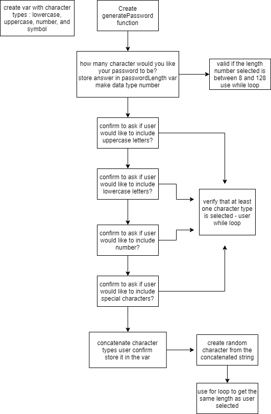

# password-generator

## Purpose
Goal was to create random password generator that allows user to choose a password length between 8 to 128 characters and select which type of characters user wanted the random password to be. 
Character types options included: uppercase, lowercase, number or special characters.

## Built With
* HTML
* CSS
* JavaScript

## Pseudo Code 

## Website
(https://chaitalizn.github.io/password-generator/)
